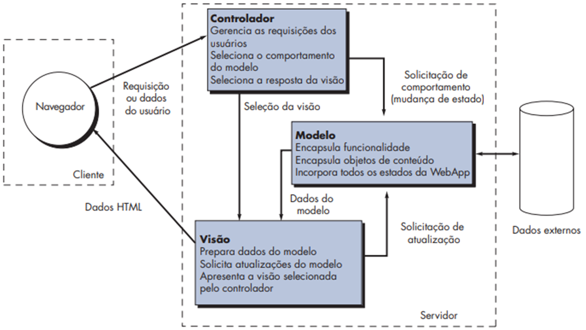

# Spring-MVC-Simple

Simples projeto Java com Spring MVC para demonstrar o funcionamento da Arquitetura Model-View-Controller (MVC).

O Modelo-Visão-Controlador (MVC) é um modelo de infraestrutura para WebApps que separa a interface do usuário da funcionalidade e do conteúdo. O Modelo contém a lógica da aplicação e objetos de conteúdo, a Visão cuida da interface e o Controlador coordena a comunicação entre eles.

Fonte: PRESSMAN, Roger S.; MAXIM, Bruce R. Engenharia de software-9. McGraw Hill Brasil, 2021.

* Criado com [Spring Initializr Java Support](https://marketplace.visualstudio.com/items?itemName=vscjava.vscode-spring-initializr)
* Baseado em [Serving Web Content with Spring MVC](https://spring.io/guides/gs/serving-web-content/)